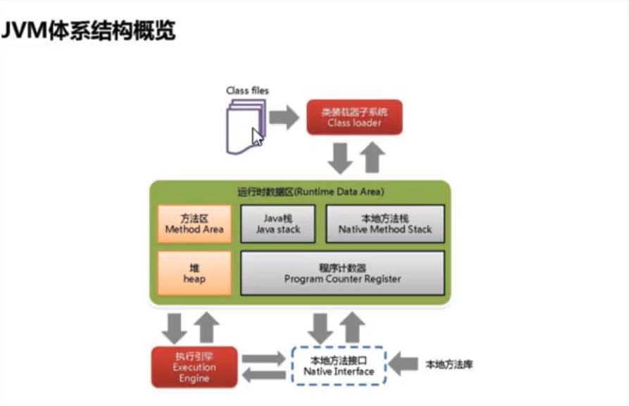

 ### 请谈谈你对JVM的理解？java8版有什么了解？

### 谈谈JVM中你对ClassLoader类加载器的认识？

### 什么是OOM？写代码分别出现StackOverflowError和OutOfMemoryError

### JVM的常用参数调优你了解吗？

### 内存快照抓取和MAT分析hprof文件干过吗？

### JVM体系结构概述

运行在操作系统之上的，与硬件没有直接交互。

#### 类装载器ClassLoader

- 虚拟机自带的加载器
  - 启动类加载器（Bootstrap）C++  
    - null
    - $JAVA_HOME/jre/lib/rt.jar
  - 扩展类加载器（Extension）Java   
    - ExtClassLoader
    - $JAVA_HOME/jre/lib/ext/*.jar
  - 应用程序类加载器（App）Java 
    - AppClassLoader
    - 也叫系统类加载器，加载当前应用的classpath的所有类 
  - 双亲委派机制 + 沙箱机制（防止恶意代码的破坏 ）
    - 某个特定的类加载器在接到加载类的请求时，首先将加载任务委托给父类加载器，一次递归，如果父类加载器可以完成类加载任务，就成功返回；只有父类加载器无法完成此加载任务时，才自己去加载。

#### 执行引擎（Execution Engine）

- 负责解释命令，提交操作系统执行。

#### 本地方法接口（Native Interface）

- 通过JNI接口调用其它语言实现底层访问。

#### 运行时数据区

- PC寄存器
  - 每个线程都有一个程序计数器，是线程私有的，就是一个指针，指向方法区中的方法字节码（用来存储指向下一条指令的地址，也即将要执行的指令代码），有执行引擎读取下一条指令，是一个非常小的内存空间，几乎可以忽略不计。
- Java 栈
  - 也叫占内存，主管Java程序的运行，在线程创建时创建，生命周期跟随线程的生命周期，线程结束内存也就释放。不存在垃圾回收问题。
  - 基本类型的变量、实例方法、引用类型的变量都是在站内存中分配。
  - StackOverFlowError
    - 递归死循环会引发此错误
- 方法区
  - 方法区时线程共享的，通常用来保存装载的类的元结构信息。
  - 常量池，静态变量，常量，字段，方法字节码，类、实例、接口初始化用到的特殊方法等。
  - Java7之前通常和永久代关联在一起。
- 堆
  - Java7之前
  - 新生区（伊甸区、幸存0区、幸存1区）、养老区、永久区（非堆内存，逻辑上存在）
  - Java8 没有永久区，变成元空间
  - 调优
    - Java 7
    - -Xms 设置初始分配大小，默认为物理内存的 1/64 
    - -Xmx 最大非配内存，默认为物理内存的 1/4
    - -XX:+PrintGCDetails 输出详细的GC处理日志
    - Runtime.getRuntime().maxMemory(); 返回 Java 虚拟机时图使用的最大内存量。
    - Runtime.getRuntime().totalMemory(); 返回 Java 虚拟机中的内存总量。
    - -Xms1024m -Xmx1024m -XX:+PrintGCDetails
  - OutOfMemoryError
    - 死循环，随机字符串叠加。

#### MAT（Eclipse Memory Analyzer）

- 分析dump文件，快速定位内存泄露；
- 获得对中对象的统计数据
- 获得对象相互饮用的关系
- 采用树形展现对象间相互饮用的情况。
- 支持使用QQL芋圆来查询对象信息。
- -XX:+HeapDumpOnOutOfMemoryError
  - OOM时导出堆到hprof文件

