### subtree

- git: 'subtree' is not a git command. See 'git --help'. 的问题

  需要单独安装 subtree

  1. 第一种方式，重新编译安装subtree。

     git clone https://github.com/git/git.git

     cd git/contrib/subtree

     sudo make prefix=/usr
     sudo make prefix=/usr install
     sudo make prefix=/usr install-doc

     Then command git subtree should be available.

  2. 第二种方式，把 subtree 复制到git目录。

     git clone https://github.com/git/git.git

     cd contrib/subtree

     cp git/contrib/subtree/git-subtree /usr/local/
     ln -s /usr/local/git-subtree /usr/bin/git-substree

  3. 测试发现第二种方法好像好使一点，但是复制的路径需要先 which git 看看git放在哪了，把git-subtree拷贝到那个目录就行了。

- 两个独立的项目，main 项目需要依赖 sub 项目，两个项目各自有独立的 git 仓库。为了方便管理将两个项目整合到一起。分两步：第一步先整合 git 仓库，第二部在 main 项目里添加 sub 项目的依赖。

  1. 第一步，使用 git subtree 将两个 git 仓库整合到一起

     1. 在 main 项目的本地 git 仓库目录下执行，添加一个远程地址。

        ```shell
        git remote add -f <sub 项目的仓库名> <sub 项目的远程仓库地址>
        ```

        

        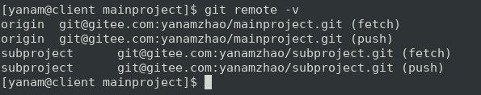

        ``` shell
        -f 表示添加远程仓库后立即执行 fetch
        ```

      2.  使用 git subtree 命令同步远程的 sub 项目

        ```shell
        git subtree add --prefix=<sub 项目的目录名> <sub 项目的仓库名> <分支> --squash
        ```

        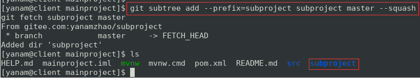

        已经把 sub 项目的原来同步下来了。

        ```shell
        --squash 表示把subtree 的改动合并成一个 commit 就不用拉取 sub 项目的完整历史纪录。
        ```

     3. 从远程仓库更新 sub 项目

        ```shell
        git fetch <sub 项目的远程仓库名> <分支>
        git fetch subproject master
        ```

        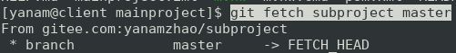

     4. 从远程仓库获取

        ```shell
        git subtree pull --prefix=<sub 项目的目录名> <sub 项目的远程分支> <分支> --squash
        git subtree pull --prefix subproject subproject master --squash
        ```

        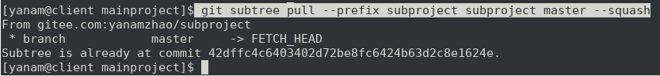

     5. push sub 项目的修改

        先进入 sub 项目的目录，然后 add  commit

        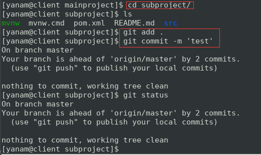

        回到上级目录执行 push

        ```shell
        git subtree push --prefix=<sub 项目的目录名> <sub 项目的远程分支名> 分支
        ```
  
        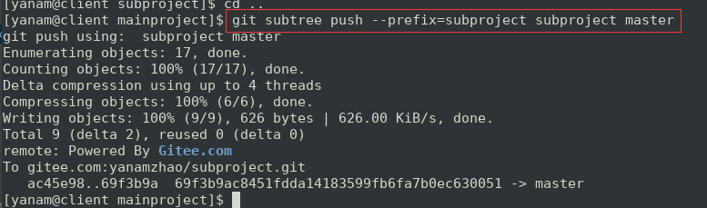
  
     6. 
  
  2. 把 sub 项目作为 main 的 module 
  
     1. 依次点击菜单： file -> Project Structure 或点击工具栏图标。
  
        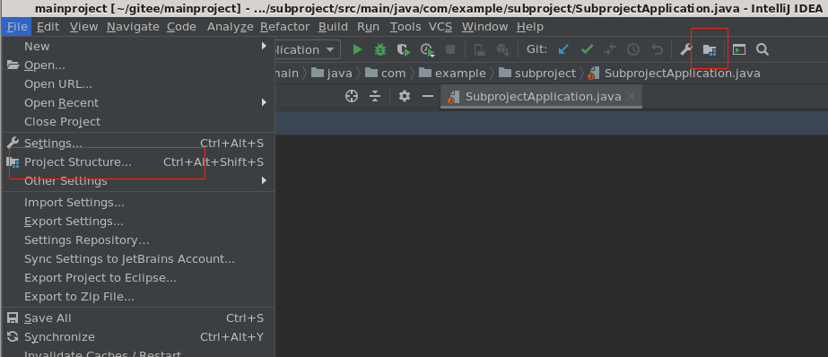
  
     2. 在打开的对话框里依次点击 Modules -> 加号 -> Import Module
  
        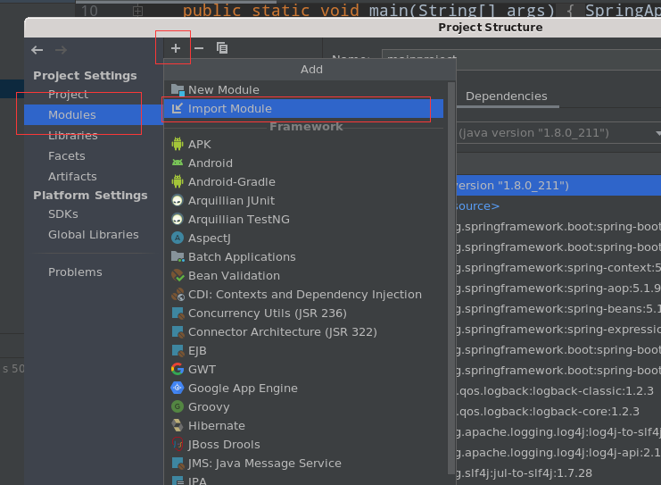
  
     3. 在弹出的对话框中选择 sub 项目所在的目录
  
        
  
        选择 sub 项目的类型，其它使用默认设置，一路下一步。
  
        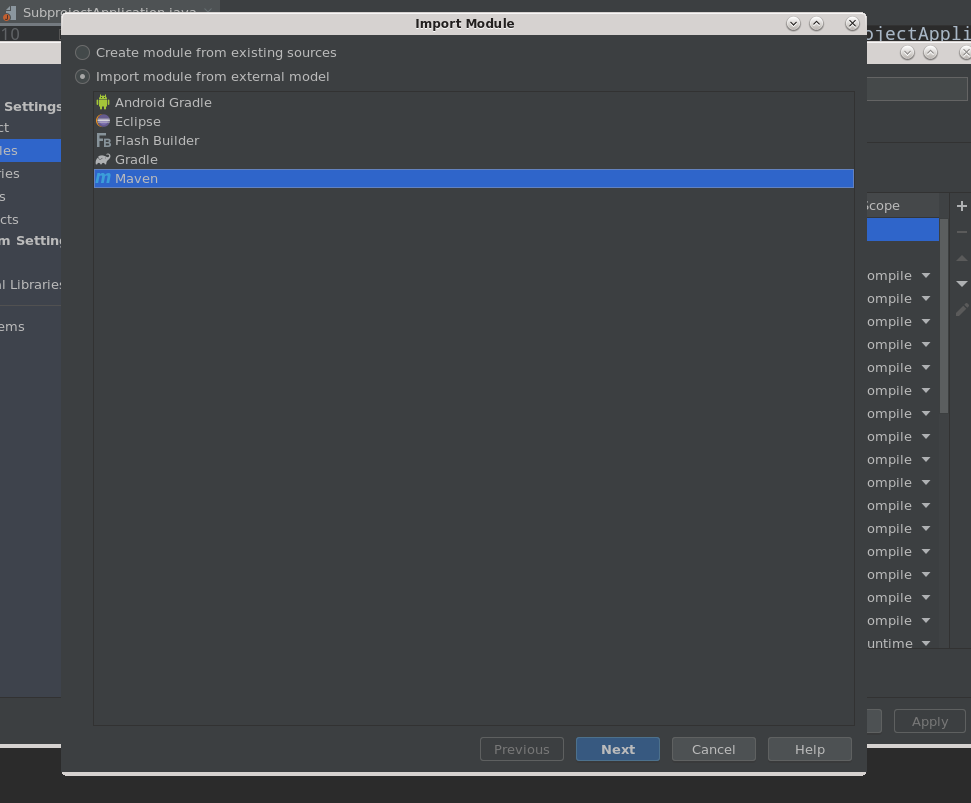
  
        
  
     4. 选择 main 项目 -> Dependencies -> 加号 -> Module Dependency ,如下图
  
        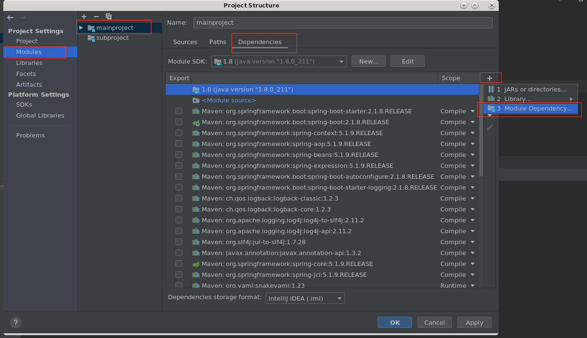
  
     5. 在弹出的对话框中选择 sub 项目，确定，最终如下图
  
        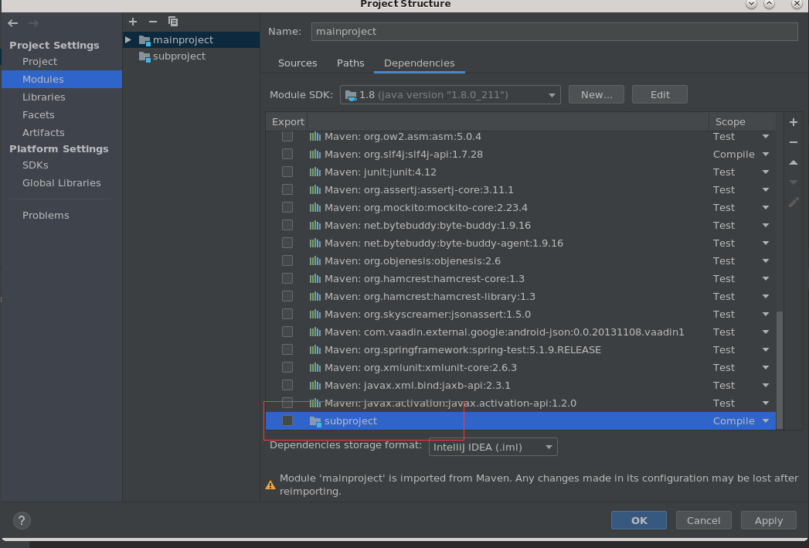
  
     6. 完成整合
  
  ​	