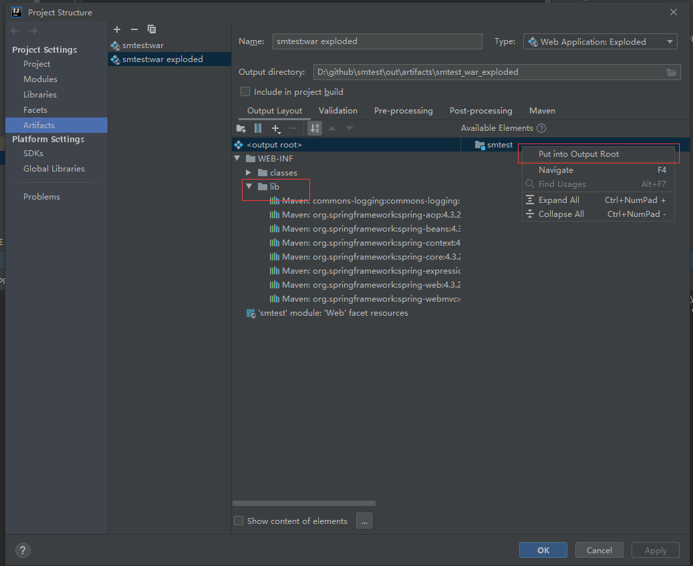

### 错误解决

#### Error:java: 不再支持源选项 5。请使用 6 或更高版本。


修改Maven的setting.xml

```xml

<profile>
    <id>jdk-11</id>

    <activation>
        <activeByDefault>true</activeByDefault>
        <jdk>11</jdk>
    </activation>
    <properties>  
        <maven.compiler.source>11</maven.compiler.source>
        <maven.compiler.target>11</maven.compiler.target>
        <maven.compiler.comilerVersion>11</maven.compiler.comilerVersion>
    </properties>  
</profile>

```

pom.xml 

```xml
    <properties>
        <project.build.sourceEncoding>UTF-8</project.build.sourceEncoding>
        <maven.compiler.encoding>UTF-8</maven.compiler.encoding>
        <java.version>11</java.version>
        <maven.compiler.source>11</maven.compiler.source>
        <maven.compiler.target>11</maven.compiler.target>
    </properties>
```

#### 创建文件显示问号，无法用IDEA打开

在 Setting -> Editor -> File Types 删除相应的文件即可。

#### 无法导入java.util.date

在 Setting -> Editor -> General -> Auto Import 删除 java.util.date 即可

### java.lang.ClassNotFoundException: org.springframework.web.servlet.DispatcherServlet



