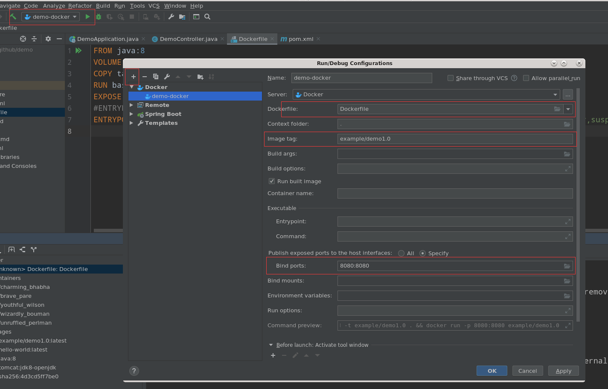
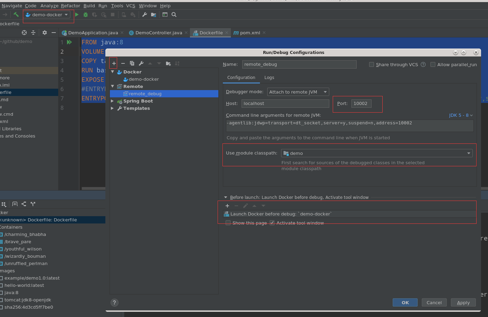

#### 编译错误

#### Error:java: 不再支持源选项 5。请使用 6 或更高版本。


修改Maven的setting.xml

```xml

<profile>
    <id>jdk-11</id>

    <activation>
        <activeByDefault>true</activeByDefault>
        <jdk>11</jdk>
    </activation>
    <properties>  
        <maven.compiler.source>11</maven.compiler.source>
        <maven.compiler.target>11</maven.compiler.target>
        <maven.compiler.comilerVersion>11</maven.compiler.comilerVersion>
    </properties>  
</profile>

```

pom.xml 

```xml
    <properties>
        <project.build.sourceEncoding>UTF-8</project.build.sourceEncoding>
        <maven.compiler.encoding>UTF-8</maven.compiler.encoding>
        <java.version>11</java.version>
        <maven.compiler.source>11</maven.compiler.source>
        <maven.compiler.target>11</maven.compiler.target>
    </properties>
```

### 创建文件显示问号，无法用IDEA打开

在 Setting -> Editor -> File Types 删除相应的文件即可。

### Docker 镜像部署 + 调试

#### 部署

```shell
vim /lib/systemd/system/docker.service	

#修改ExecStart这行,开启远程访问
ExecStart=/usr/bin/dockerd  -H tcp://0.0.0.0:2375  -H unix:///var/run/docker.sock

#重新加载配置文件
systemctl daemon-reload

#重启服务
systemctl restart docker.service 

netstat -nlpt | grep 2375	#查看端口是否启用
curl http://127.0.0.1:2375/info		#验证是否生效

#安装Docker插件，可能默认已经安装

```

File -> Setting -> Build,Excution,Deployment -> Docker 打开配置界面


修改 pom.xml

```xml
<properties>
    <java.version>1.8</java.version>
    <docker.image.prefix>bozai</docker.image.prefix>
</properties>

<build>
    <plugins>
        <plugin>
            <groupId>org.springframework.boot</groupId>
            <artifactId>spring-boot-maven-plugin</artifactId>
        </plugin>

        <plugin>
            <groupId>com.spotify</groupId>
            <artifactId>docker-maven-plugin</artifactId>
            <version>1.0.0</version>
            <configuration>
                <imageName>${docker.image.prefix}/${project.artifactId}</imageName>
                <dockerDirectory></dockerDirectory>
                <resources>
                    <resource>
                        <targetPath>/</targetPath>
                        <directory>${project.build.directory}</directory>
                        <include>${project.build.finalName}.jar</include>
                    </resource>
                </resources>
            </configuration>
        </plugin>
    </plugins>
</build>
```

工程目录下创建 Dockerfile


```dockerfile
FROM java:8
VOLUME /tmp
COPY target/demo-0.0.1-SNAPSHOT.jar demo.jar
RUN bash -c "touch /demo.jar"
EXPOSE 8080
ENTRYPOINT ["java","-jar","demo.jar"]
```

创建 Docker 镜像



执行即可

### 远程调试

修改Dockerfile

```dockerfile
FROM java:8
VOLUME /tmp
COPY target/demo-0.0.1-SNAPSHOT.jar demo.jar
RUN bash -c "touch /demo.jar"
EXPOSE 8080
#ENTRYPOINT ["java","-jar","demo.jar"]
ENTRYPOINT ["java","-Djava.security.egd=file:/dev/./urandom","-agentlib:jdwp=transport=dt_socket,server=y,suspend=n,address=10002","-jar","demo.jar"]
#-agentlib:jdwp=transport=dt_socket,server=y,suspend=n,address=10002 这行是用于远程调试使用的，让其远程程序需要支持调试的jvm参数配置。
```

创建远程调试



启动调试即可